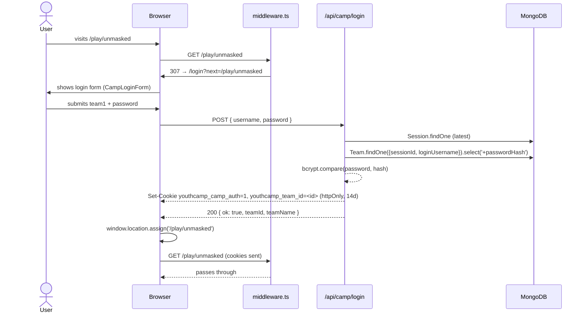
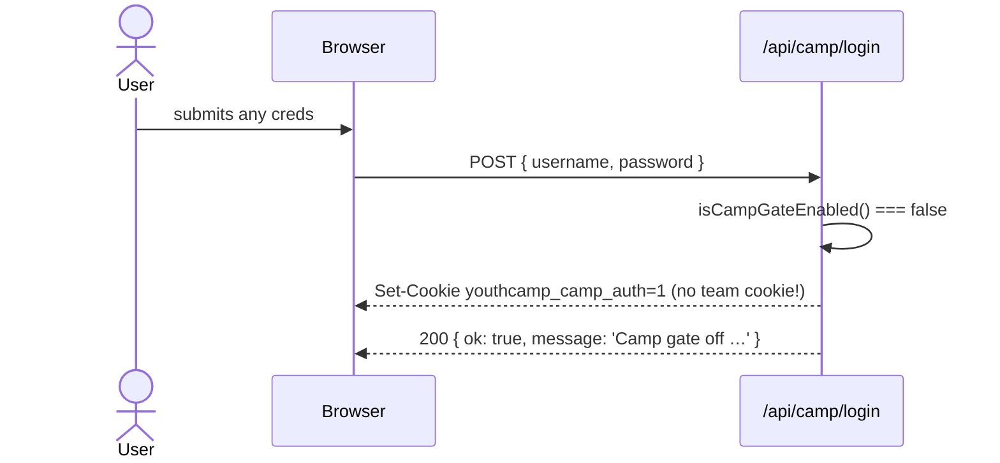
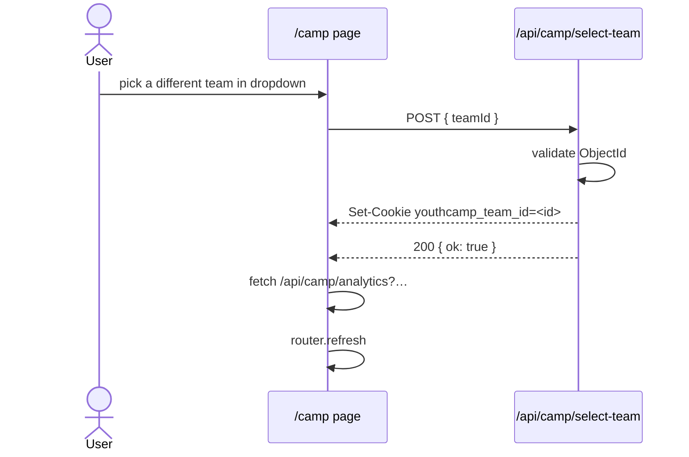
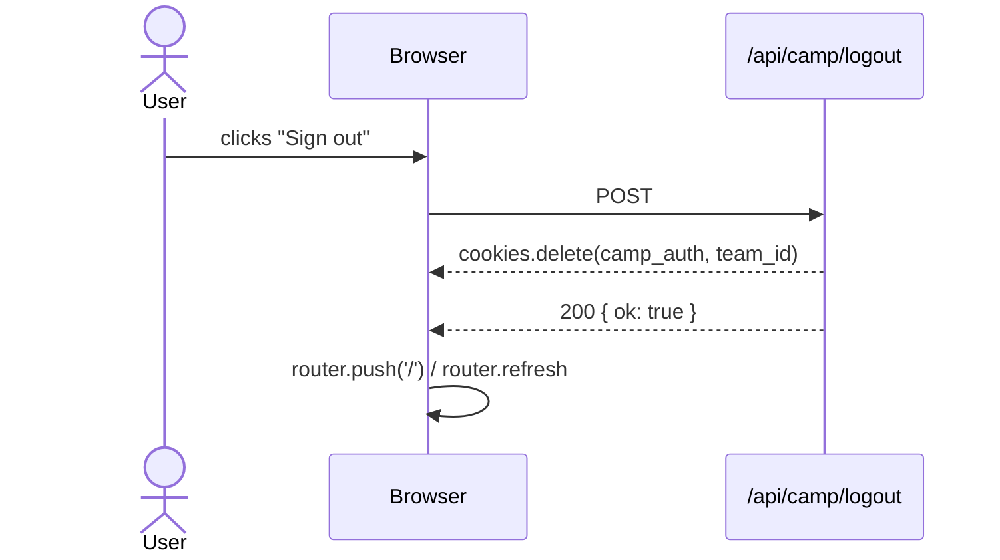
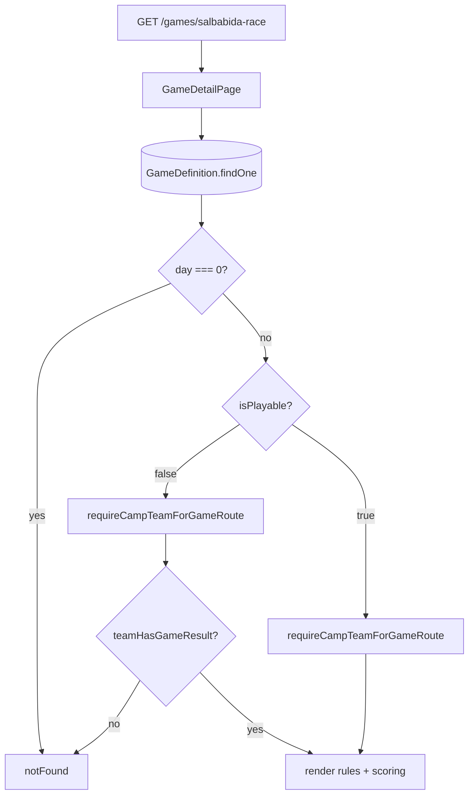

# camp-auth — flows

Mermaid sequence diagrams for the load-bearing flows.

## Login flow (gate ON)



The form uses `window.location.assign(next)` instead of `router.push` ([camp-login-form.tsx:33](../../app/login/camp-login-form.tsx#L33)) — full navigation guarantees the new httpOnly cookies are sent on the next request, avoiding soft-nav edge cases.

## Login flow (gate OFF)



When the gate is off, the login route **does not** check credentials and **does not** set `youthcamp_team_id`. Game routes will still demand a team cookie via `requireCampTeamForGameRoute`, redirecting to `/login` if missing. That's why local dev usually still needs you to log in — the team cookie is required.

## Gate redirect flow

```mermaid
flowchart TD
  Req[Request /camp/* or /play/*] --> M{middleware.ts}
  M -->|gate disabled| Pass[NextResponse.next]
  M -->|gate enabled, cookie='1'| Pass
  M -->|gate enabled, cookie missing| Redir[307 /login?next=...]
  Redir --> LoginPage[/login page]
  LoginPage -->|already authed| Auto[redirect safeCampLoginNext]
  LoginPage -->|not authed| Form[Show CampLoginForm]
```

[middleware.ts:9-27](../../middleware.ts#L9-L27)

## Team selection flow (post-login)



Note `/api/camp/select-team` does **not** re-check credentials. The `youthcamp_camp_auth=1` cookie is taken as proof of authentication; the dashboard select is a UI-level "act as team X". This is fine because all teams in the camp share the same season — there's no privacy boundary between them.

## Logout flow



[CampLogoutButton](../../components/camp/camp-logout-button.tsx), [CampHeaderLogout](../../components/camp/camp-header-logout.tsx).

## Game-route SSR flow (Day 1–2 detail page)



The `/games/[slug]` page is locked behind a published `GameResult` for non-playable events — teams can't see scoring details for a game that hasn't been judged yet. Playable engines (`mindgame`, `unmasked`) skip that check. See [team-game-access.ts:55-81](../../lib/camp/team-game-access.ts#L55-L81).
