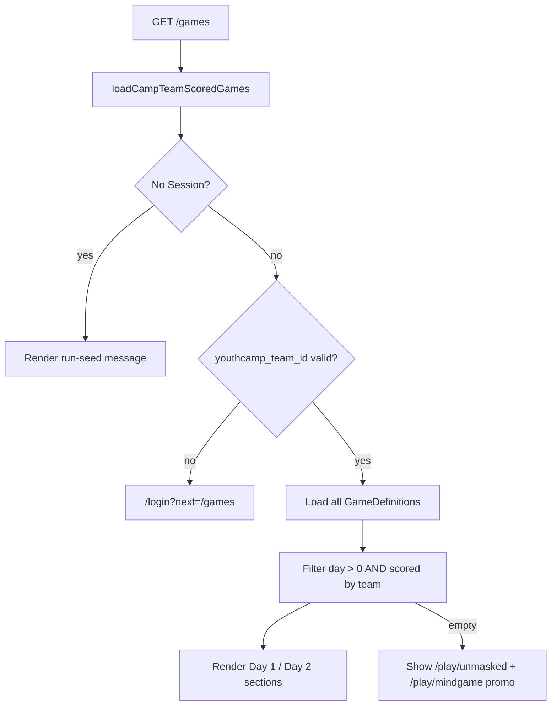
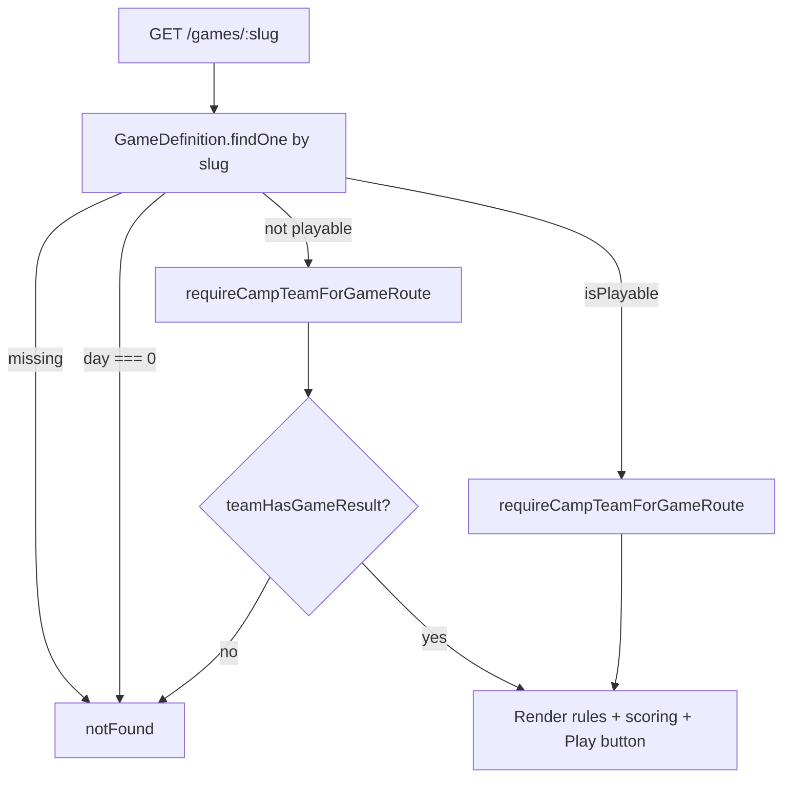
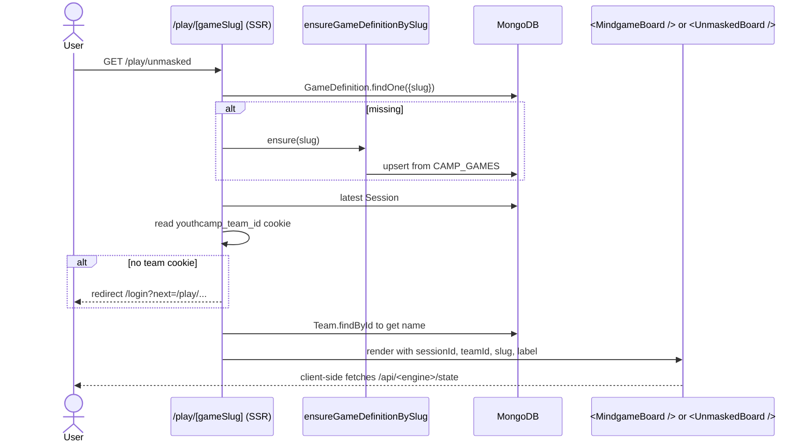
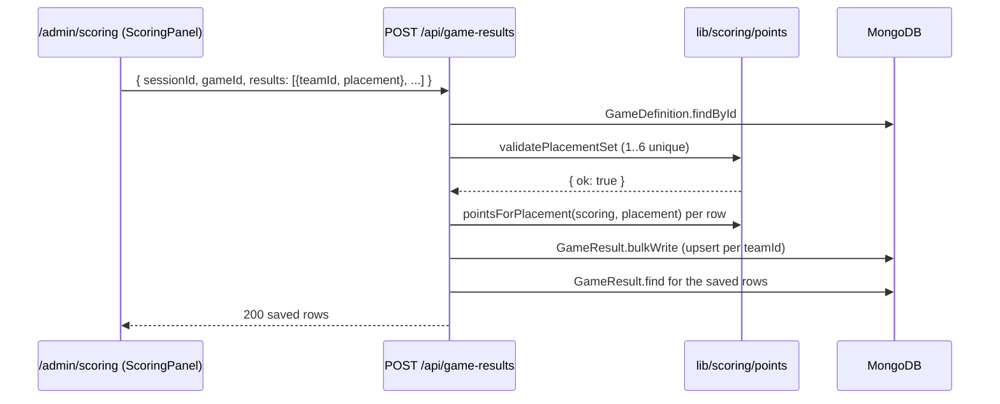

# games-shared — flows

## /games visibility flow

`scoredGameIds` is the set of `GameResult.gameId` values for `(sessionId, teamId)`. A game enters the list only after the facilitator publishes a result for that team.

## /games/[slug] flow

Playable games (`mindgame`, `unmasked`) skip the result check. Non-playable games (manually-judged) require a published score before the team can see scoring details — same scoreboard-reveal UX as `/games`.

## /play/[gameSlug] flow

## Game result upsert flow (placement)

For `manual_points` mode, `clampManualPoints` rounds + bounds, then `validateManualPointsSet` verifies all 6 teams are present and unique. Placements are derived by ranking points (with sortOrder tiebreak) before write.

See [scoring/flows.md](../scoring/flows.md) for deeper detail.
