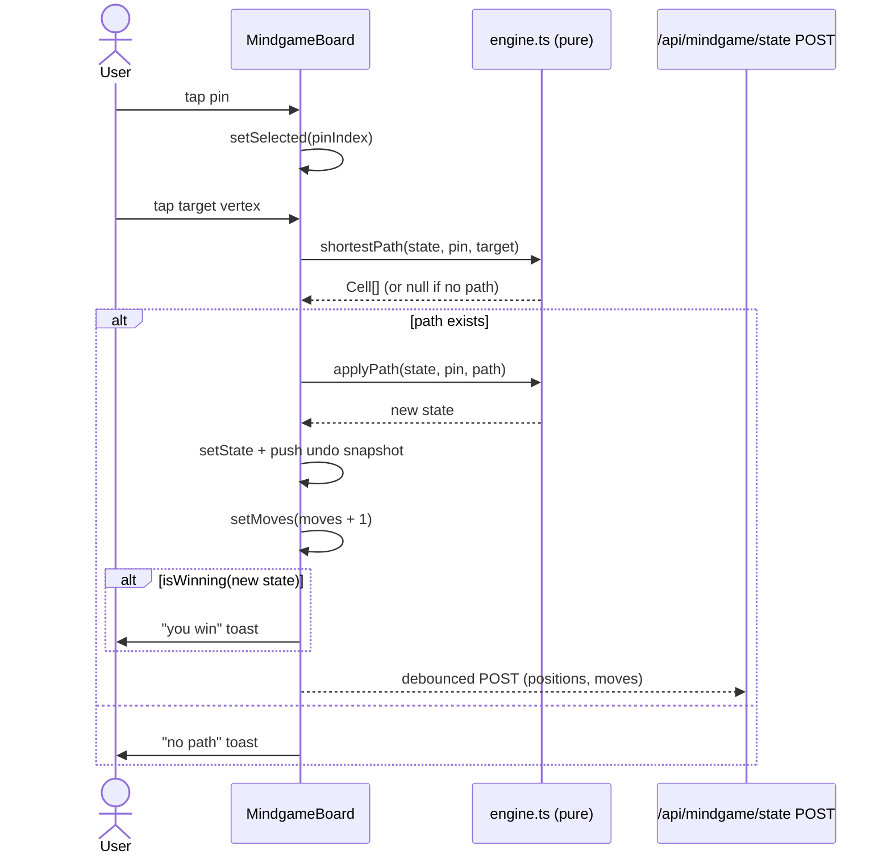
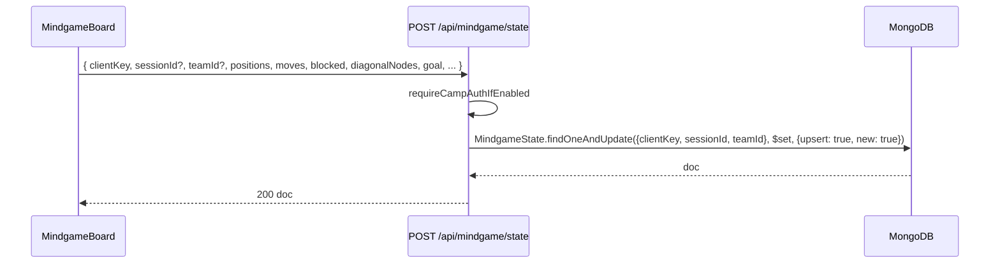
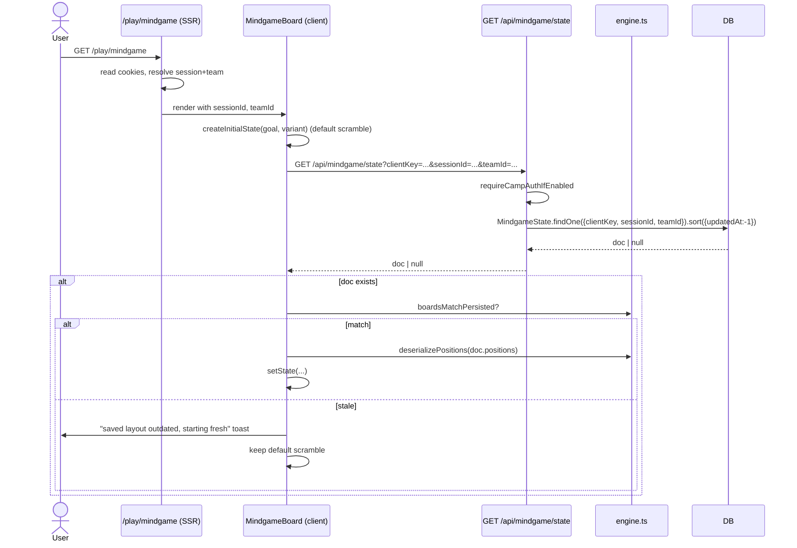

# mindgame — flows

## Move flow (client-side, no server round-trip)

The engine is pure — every step is computed locally. Persistence is fire-and-forget, debounced.

## Persistence flow

Upsert keyed by the unique tuple. The route doesn't validate `positions` against the engine — it stores whatever the client sends. The client is the source of truth.

## Load flow

If the persisted `blocked` or `diagonalNodes` arrays don't match the live engine layout, the save is discarded.

## Undo flow

Pure-client. Each successful move pushes a snapshot onto a `useRef` stack (capped at 400). Undo pops a snapshot and re-renders. Undo doesn't immediately persist — the next move (or explicit save action) will.

## Win flow

When `isWinning(state)` is true after a move:
- `<MindgameBoard>` shows a success toast.
- The win is *not* recorded as a `GameResult` — mindgame is part of the Amazing Race station, scored by facilitators based on observed completion. The in-app state is informational.
