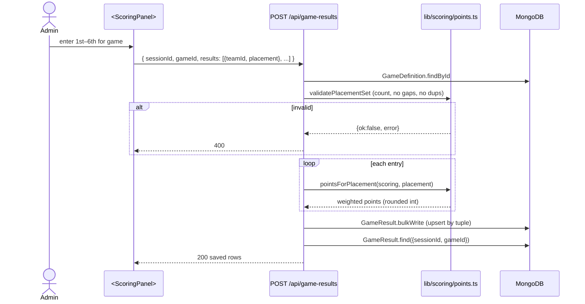
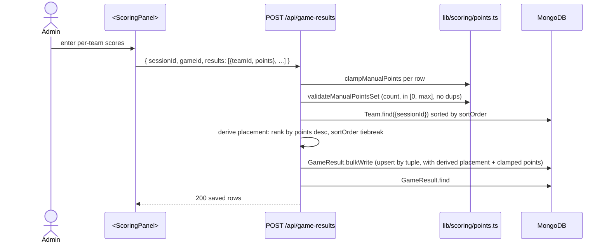
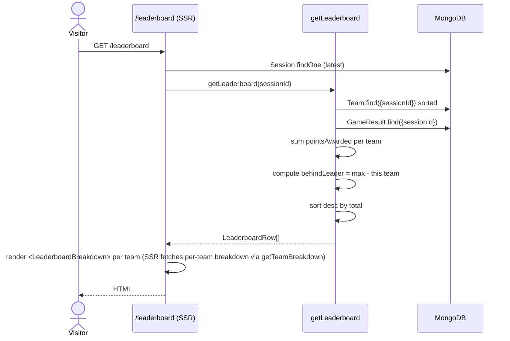
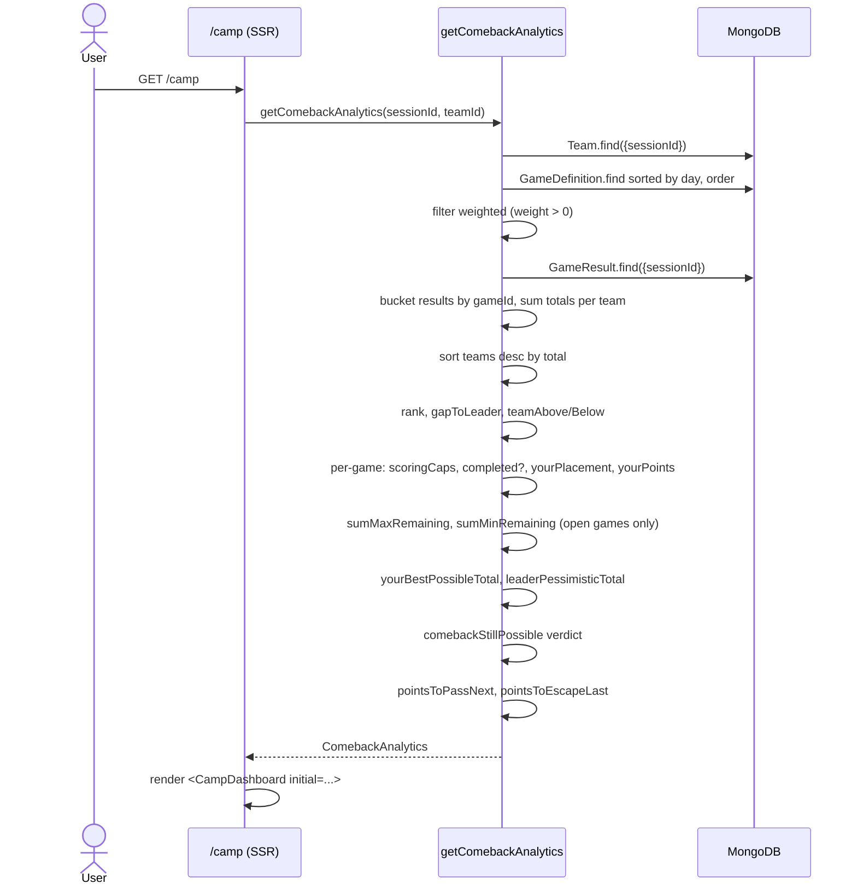

# scoring — flows

## Result write flow (placement mode)



## Result write flow (manual mode)



## Leaderboard read flow



`<LeaderboardBreakdown>` is itself a server component. It calls `getTeamBreakdown(sessionId, teamId)` to get per-game rows, then renders an accordion. The first paint includes all teams' breakdowns.

## Comeback compute flow



After this, the team picker on the dashboard re-fetches via `GET /api/camp/analytics`. Same function, different transport.

## "Comeback still possible" verdict logic

```ts
if (yourBestPossibleTotal > leaderPessimisticTotal) {
  // "If you take 1st in every remaining game and the leader slips, a comeback is still mathematically possible."
} else if (yourBestPossibleTotal <= leaderCurrent) {
  // "Catching the current leader would require extra scoring opportunities — aim to climb and avoid last place."
} else {
  // "Focus on the next game — every placement still matters." (default)
}
```

Read closely: `leaderPessimisticTotal` = `leaderCurrent + leaderRemainingMin`. The "still possible" verdict requires beating the leader's *worst-case* finish in remaining games — a higher bar than just "yourBestPossibleTotal > leaderCurrent".
