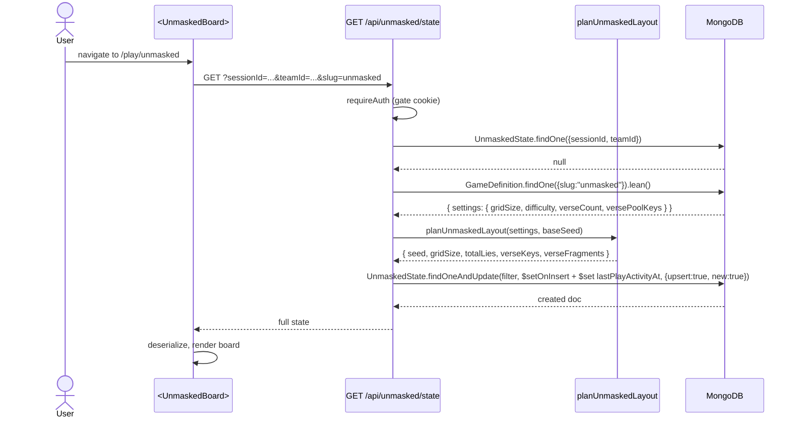
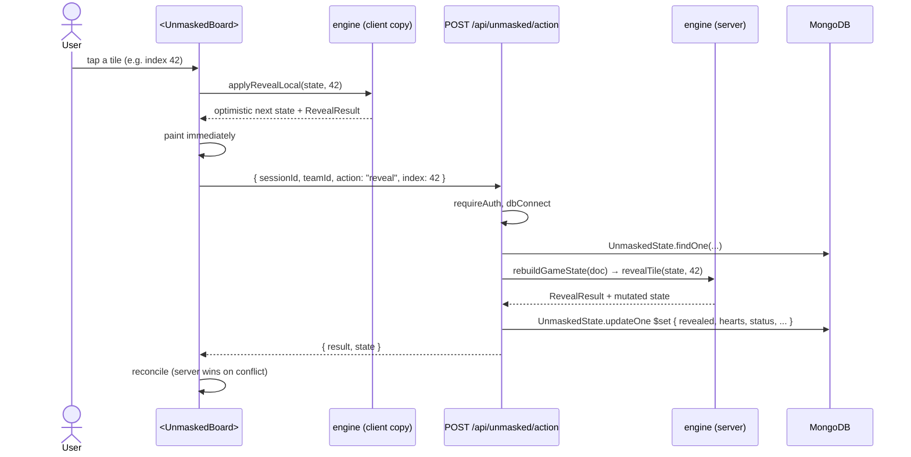
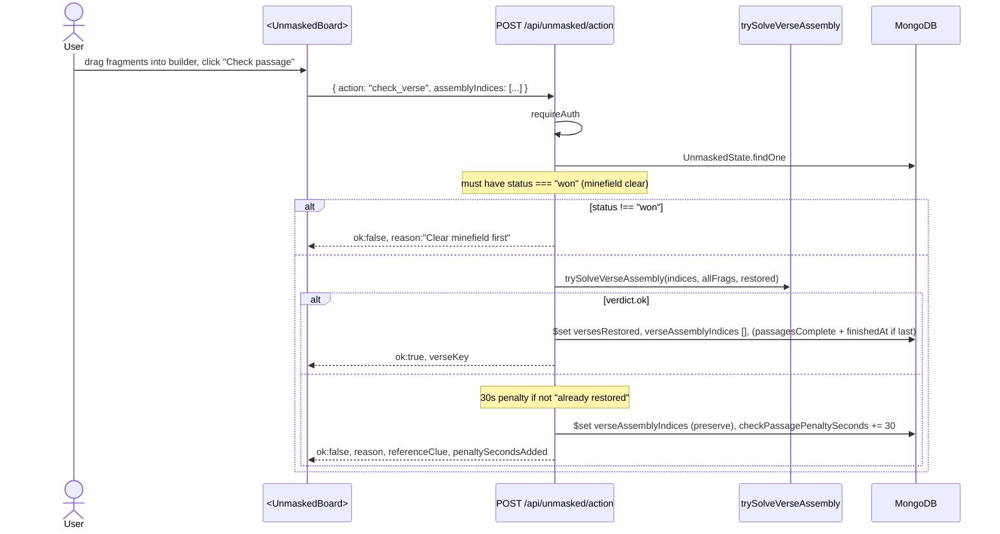
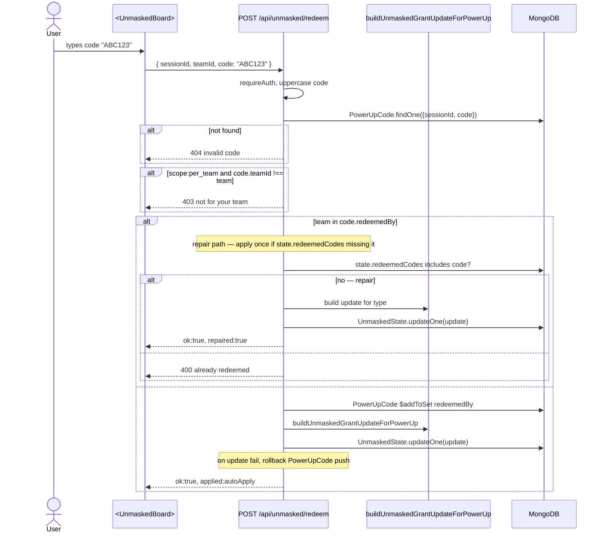
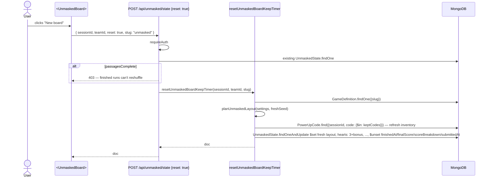
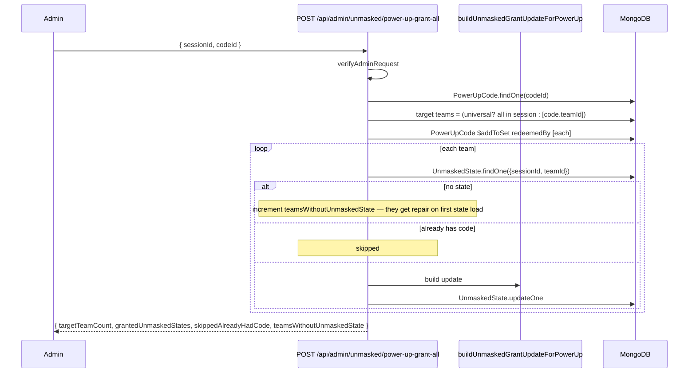

# unmasked — flows

## First-open flow (no save yet)

The first GET both initializes the run and returns the state. Default values: 3 hearts, status="playing", empty inventory. `startedAt` set to now.

## Reveal flow (single tap)

If the tile is a **lie**:
- Without shield: `state.hearts--`. If hearts hit 0 → `status = "lost"`, `finishedAt` set.
- With shield: `state.shielded = false` (consumed), no heart loss.
- Result returned: `{ type: "lie", text, heartsLeft, shieldUsed }`.

If the tile is a **truth**: `floodReveal` cascades through 0-adjacency tiles. Result: `{ type: "number", value, floodRevealed: [...] }`.

If the tile is a **verse**: same as truth (it's a safe tile) but result includes `text, order, verseKey, floodRevealed`.

After reveal, if `checkWin(state)` (every non-lie revealed): `status = "won"`. If `verseKeys` is empty (no verses on this board), the win also sets `passagesComplete = true` and `finishedAt`.

## Verse-check flow

The penalty adds to the displayed clock. Reference clue (e.g. "Psalm 139:14") is shown only on a wrong attempt — see [engine.ts:206-208](../../app/api/unmasked/action/route.ts#L206-L208) — *as a hint*, not a giveaway.

## Power-up redemption flow

Auto-apply types (`extra_heart`, `shield`) immediately mutate state in the same update — `$inc` for hearts, `$set` for shield. Other types push entries with `used: false` for the player to use later.

## Reset board (self-service "New board")

`startedAt` is preserved (the run timer keeps ticking). Bonus hearts and shield are recomputed from the redeemed codes — every redemption replays as if you'd just typed the code again.

## Auto-grant-all flow (admin)

Teams without an existing `UnmaskedState` get the grant via the redeem repair path on first state load. The repair check only happens on a literal redeem call though — for the initial load, the team enters the `redeemedBy` list but their `UnmaskedState.redeemedCodes` won't include the code until they manually redeem it again. **(This is a known mild oddity — the auto-grant pre-fills the code's roster but doesn't pre-apply for unborn states.)** See [gotchas.md](./gotchas.md).
